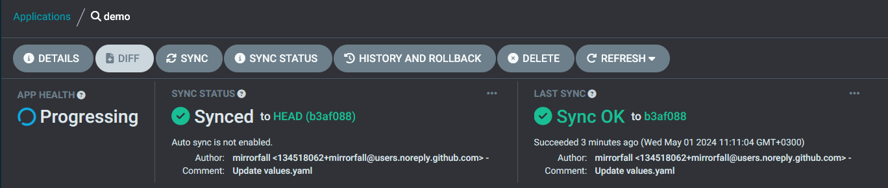
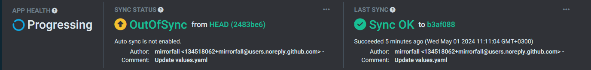
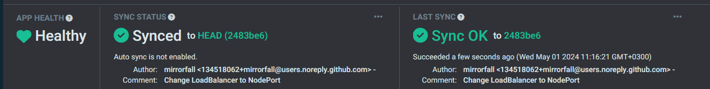
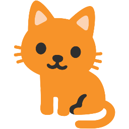
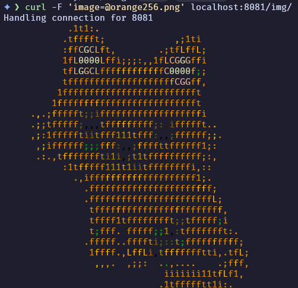

## Proof of Concept
Створити коротке демо додатку `AsciiArtify`, що демонструє як працює додаток, розгорнутий за допомогою налаштованої інфраструктурі.

### Steps
1. Checker whether `AsciiArtify`  works by sending request to it
```bash
$ kubectl config set-context --current --namespace=demo
$ kubectl port-forward svc/ambassador 8081:80&
$ curl localhost:8081
k8sdiy-api:599e1af%
```

2. It looks good, however, ArgoCD cannot confirm the health status of the application


3. The issue is located and it is related to service type of api-gateway, modified the value from `LoadBalancer` to `NodePort`. ArgoCD located the changes.


4. Apply the changes and everything looks good now, let's test how application works


5. We have an image with the cat and will use it for the MVP
 

```bash
curl -F 'image=@doc/.img/orange256.png' localhost:8081/img/
```
6. And the final result is this asciified orange cat!

